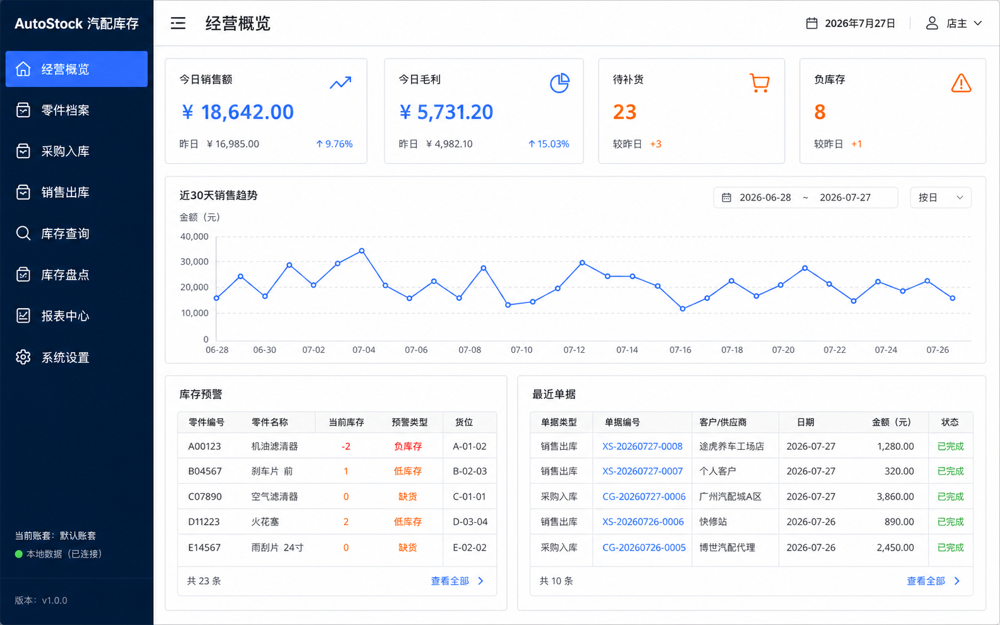
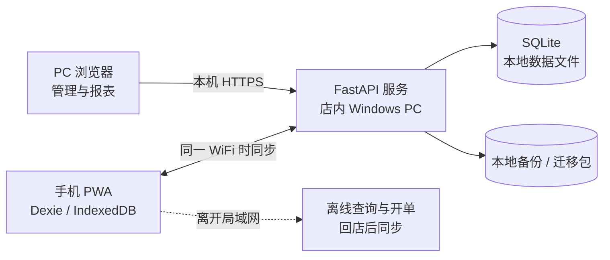

# AutoStock

> 面向汽车零部件门店的本地优先进销存系统：用店内现有 Windows PC 充当数据中枢，手机可离线查库存、开单，回到同一局域网后再同步。

AutoStock 由 PC 管理端、手机 PWA 和本地 FastAPI 服务组成。业务数据保存在自己的电脑中，不依赖云服务器、托管数据库或第三方 SaaS，适合数据量适中、希望长期控制成本的小型门店与个人经营者。



## 为什么适合轻量、节约部署

| 常见云端方案支出 | AutoStock 的做法 |
| --- | --- |
| 云服务器月租 | 使用店内现有 Windows PC，无服务器租金 |
| 云数据库费用 | 使用本地 SQLite 单文件数据库 |
| 域名与公网 HTTPS 证书 | 局域网内使用自动生成的本地 CA 和 HTTPS 证书 |
| 原生 App 开发与分发 | 手机端采用可安装到主屏幕的 PWA |
| 持续联网要求 | 手机离开店内网络后仍可使用本地数据开单 |
| 云端备份套餐 | 支持本地备份与迁移包，可自行复制到 U 盘或其他安全位置 |

软件本身不要求购买云资源。实际使用成本主要是现有 PC、路由器的电力，以及用户自行选择的备份介质。由于服务不暴露到公网，远程访问和异地实时同步不属于本项目的目标场景。

## 核心能力

- 零件、分类、品牌、供应商与客户档案管理
- 采购入库、销售出库、退货、盘点、撤销与红冲
- 库存查询、库存预警和移动加权成本
- 销售、采购、毛利和进销存统计报表
- Excel 导入导出、自动备份、恢复与换机迁移
- PC 登录会话、手机配对令牌和局域网 HTTPS
- 手机端 PWA、IndexedDB 本地数据库和离线待同步队列
- 基于 ULID、幂等推送和 LWW 冲突记录的双端同步

库存以 append-only 的 `stock_ledger` 流水为唯一事实来源，`stock_snapshot` 只用于加速查询，并可随时从流水重新计算。金额统一以整数“分”存储，避免浮点误差。

## 运行方式



- PC 端通过浏览器完成完整业务管理。
- 手机端页面始终读取 IndexedDB；网络只负责把 PC 数据同步到本地。
- 手机在外、PC 关机或网络中断时，已安装的 PWA 仍可打开并记录业务。
- 手机回到与 PC 相同的 WiFi 后，再推送本地变更并拉取最新数据。

## 技术栈

| 层 | 技术 |
| --- | --- |
| 后端 | Python 3.11+、FastAPI、SQLAlchemy、Pydantic、Alembic |
| PC 前端 | Vue 3、TypeScript、Element Plus、Pinia、ECharts |
| 手机前端 | Vue 3、TypeScript、Vant、Pinia、Dexie、Workbox PWA |
| 数据存储 | SQLite（WAL 模式） |
| 通信 | 局域网 HTTPS、离线增量同步 |
| 打包 | PyInstaller 单文件 Windows EXE |

## 快速开始

### 1. 安装后端

```powershell
cd backend
python -m venv .venv
.\.venv\Scripts\Activate.ps1
python -m pip install -r requirements-dev.txt
python -m alembic upgrade head
```

### 2. 安装前端依赖

项目固定使用 pnpm 11.17.0，以保证本地与 CI 使用相同的锁文件工具链。仓库保留 pnpm 的依赖发布时间检查，只对已经审核并锁定的精确版本设置例外。

```powershell
cd ..
corepack enable
pnpm.cmd install --frozen-lockfile
```

### 3. 开发模式

分别打开终端运行：

```powershell
# 后端
cd backend
.\.venv\Scripts\Activate.ps1
python -m uvicorn app.main:app --reload --port 8756
```

```powershell
# PC 前端：http://127.0.0.1:5173
pnpm.cmd run dev:pc
```

```powershell
# 手机前端：http://127.0.0.1:5174/m/
pnpm.cmd run dev:mobile
```

## 本地生产部署

构建两个前端后，由 FastAPI 同时托管 PC 页面 `/` 和手机页面 `/m`：

```powershell
.\backend\.venv\Scripts\Activate.ps1
python scripts\build_web.py
cd backend
python -m alembic upgrade head
python run_web.py
```

服务默认使用：

- `https://<PC局域网IP>:8756`：PC 管理端、手机端与 API
- `http://<PC局域网IP>:8757/ca.crt`：Android 本地 CA 下载入口
- `%APPDATA%\AutoStock\autostock.db`：SQLite 数据文件
- `%APPDATA%\AutoStock\backups\`：默认备份目录

可通过 `AUTOSTOCK_DATA_DIR` 指定其他数据目录。正式供手机访问时应使用 `run_web.py` 提供的 HTTPS，不要用普通 HTTP 代替，否则 PWA 的 Service Worker 无法在局域网 IP 上正常工作。

详细的固定 IP、防火墙、证书、手机配对和备份说明见 [PC + Android 配置教程](docs/操作手册/配置教程.md)。

## Windows 单文件打包

```powershell
.\backend\.venv\Scripts\python.exe scripts\package_windows.py
```

产物为 `release/AutoStock.exe`。首次启动会自动执行数据库迁移、生成本地 CA 与服务器证书，并启动 8756/8757 两个服务。

## 验证

```powershell
cd backend
python -m pytest -q
cd ..
pnpm.cmd run test:shared
pnpm.cmd run build:pc
pnpm.cmd run build:mobile
python scripts\reconcile.py
```

## 项目文档

- [系统设计说明书](docs/系统设计.md)
- [项目目录结构](docs/项目目录结构.md)
- [开发任务拆分](docs/开发任务拆分.md)
- [PC + Android 配置教程](docs/操作手册/配置教程.md)

## 适用边界

AutoStock 优先服务于单店、家庭仓库和小型汽配经营场景。它的核心取舍是用本地设备换取更低的持续费用和更强的数据自主权，因此需要用户自行做好 PC 维护和异地备份。若业务必须支持多门店公网实时协同、全天候远程访问或云端灾备，应在现有设计之外增加安全的公网基础设施。
